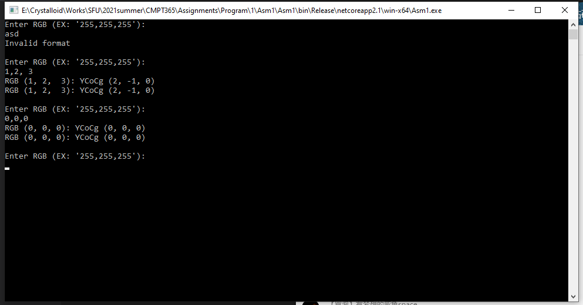

# How to compile:
## Supported Platform:
    Windows10 64-bit
## Prerequisite:
    Microsoft .Net Core SDK 2.1.x
## Command: 
```powershell
dotnet publish -r win-x64 -c Release -p:PublishSingleFile=true --self-contained true
```

# How to run:
    1. Double click Asm1.exe
    2. Enter RGB values with ',' seperated



# Output:
    First line output is computed by matrix multiplication.
    Second line output is computed by leap algorithm.